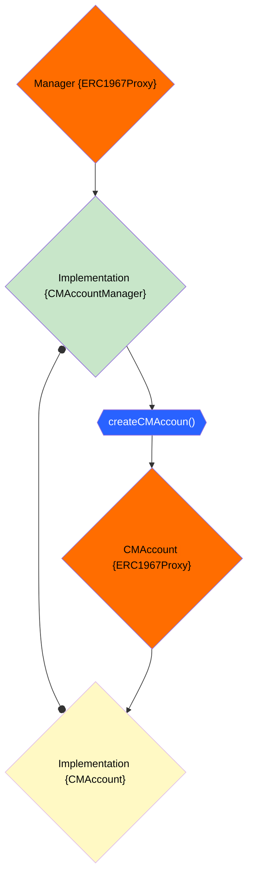

# Camino Messenger Contracts

[](https://camino.network/) [](https://discord.com/channels/949247897688494150/1182680860797960253)

[](https://github.com/chain4travel/camino-messenger-contracts/actions/workflows/ci.yaml)

This repository contains the smart contracts for the [Camino
Messenger](https://camino.network/camino-messenger-sets-the-global-standard-in-travel-data-management-and-distribution/).

> [!WARNING]
> These contracts are currently in the development phase. The ABI is
> subject to change frequently until they are released into production.

## Quickstart

### Clone the repo and change directory into

```sh
git clone git@github.com:chain4travel/camino-messenger-contracts.git
cd camino-messenger-contracts
```

### Install packages

```sh
yarn install
```

### Run tests. This will compile the contracts and run the tests:

```sh
yarn test
```

## Contracts

### CMAccount

The `CMAccount` contract represents a Camino Messenger account. Currently, it
includes functionalities for the management of bots. More features will be
introduced in the future.

This contract works closely with the `CMAccountManager` to handle accounts.

### CMAccountManager

The `CMAccountManager` contract acts as a manager for `CMAccount` contracts. It
handles the creation, registration, verification, and management of accounts. It
also keeps records for the developer wallet, fees, and `CMAccount` implementation
address. Accounts can only be upgraded to the implementation address that the
manager holds.

### ChequeManager

The `ChequeManager` contract handles the processing of cheques. It verifies the
signatures, checks the validity of the cheques, and transfers the funds between
accounts. It also calculates the developer fee and transfers it to the developer's
wallet.

This is a base contract that is inherited by the `CMAccount` contract.

### KYCUtils

The `KYCUtils` contract provides utility functions for KYC (Know Your Customer).

### Proxies

For `CMAccountManager` and `CMAccount` contracts, an `ERC1967Proxy` (UUPS) is used.

The **`hardhat-ignition`** module deploys the `CMAccountManager` contract and then
deploys an `ERC1967Proxy` proxy, setting the implementation address to the
`CMAccountManager`'s address. We will call this proxy **managerProxy** or simply
**manager** in this document.

Then a `CMAccount` contract is deployed, and its address is set by calling
`managerProxy.setAccountImplementation(CMAccount.getAddress())`. After that, the
manager is ready to create CM accounts.

Calling `managerProxy.createCMAccount(...)` with the necessary arguments creates an
`ERC1967Proxy` and sets the implementation address to the recorded account
implementation address in the manager. After it is deployed, it is immediately (same
transaction) initialized with the given arguments.

#### Relation of contracts with each other



## Deploy Contracts Locally

### Run local hardhat node

```
yarn hardhat node
```

### Deploy contracts using the ignition module

```
yarn hardhat ignition deploy ignition/modules/0_development.js --network localhost
```

### Output should be similar to this

```
yarn run v1.22.19
$ /work/github.com/chain4travel/camino-messenger-contracts/node_modules/.bin/hardhat ignition deploy ignition/modules/0_development.js --network localhost
Hardhat Ignition 🚀

Deploying [ CMAccountManagerModule ]

Batch #1
  Executed CMAccountManagerModule#CMAccount
  Executed ProxyModule#CMAccountManager

Batch #2
  Executed ProxyModule#CMAccountManagerProxy

Batch #3
  Executed CMAccountManagerModule#CMAccountManagerProxy

Batch #4
  Executed CMAccountManagerModule#CMAccountManagerProxy.initialize
  Executed CMAccountManagerModule#CMAccountManagerProxy.setAccountImplementation

[ CMAccountManagerModule ] successfully deployed 🚀

Deployed Addresses

CMAccountManagerModule#CMAccount - 0x5FbDB2315678afecb367f032d93F642f64180aa3
ProxyModule#CMAccountManager - 0xe7f1725E7734CE288F8367e1Bb143E90bb3F0512
ProxyModule#CMAccountManagerProxy - 0x9fE46736679d2D9a65F0992F2272dE9f3c7fa6e0
CMAccountManagerModule#CMAccountManagerProxy - 0x9fE46736679d2D9a65F0992F2272dE9f3c7fa6e0
Done in 1.73s.
```

You can also see your deployed contract addresses in the
`ignition/deployments/<chainid>/deployed_addresses.json` file.

### Visualize the deployment

```
yarn hardhat ignition visualize ignition/modules/0_development.js
```

This will open a browswer tab with the deployment flow visualized.
